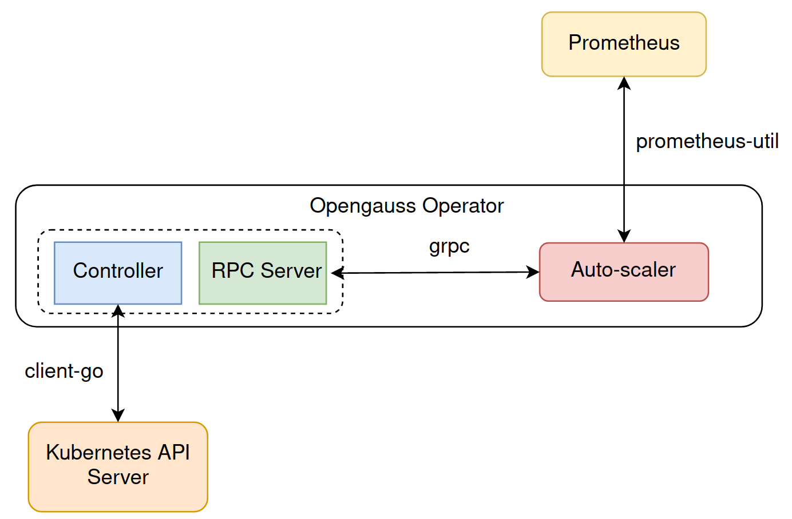
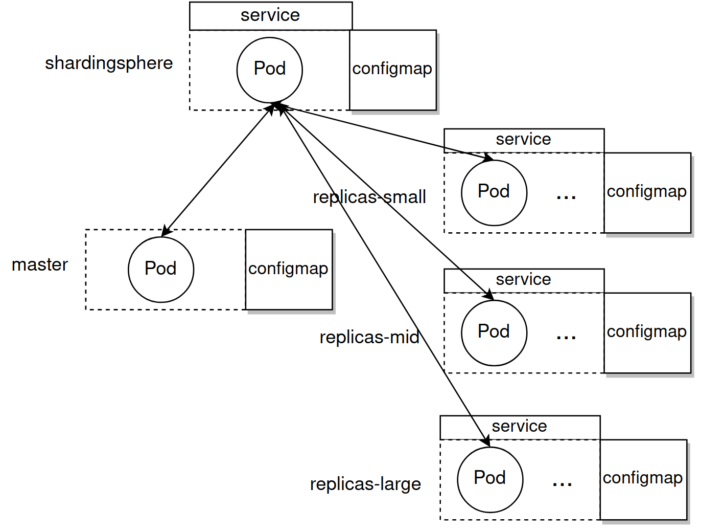

# openGauss-operator

The openGauss-operator uses the [client-go](https://github.com/kubernetes/client-go) library to develop a custom controller monitoring, scheduling and updating openGauss cluster in kubernetes.

The openGuass-operator uses the [grpc in go](https://grpc.io/docs/languages/go/) to comminucate with openGauss-scaler.

### Table of Content

- [Build & Run](#Build-&-Run)
- [Structure](#Structure)
- [Develop](#Develop)
- [Shardingsphere](#4-configuration-about-shardingsphere)
- [Test](#5-test)
- [Scripts](#6-some-useful-scripts)

## 1. Build & Run
### Deploy Prometheus Monitoring

Use prometheus to monitor the pod and node status.

Follow [kube-prometheus quick start](https://github.com/prometheus-operator/kube-prometheus#quickstart) to install prometheus stack.

### Deploy OpenGauss controller

Fetch the project
```sh
git clone https://github.com/waterme7on/openGauss-operator.git
cd openGauss-operator
```

Build and Run in Process
```sh
go build -o controller .
# kubeconfig won't be needed if run in-cluster
./controller -kubeconfig=$HOME/.kube/config
```

Create Crd, PV and example OpenGauss cluster

```sh
# Before execute following command, please label one worker node with app=opengauss and create director /root/opengauss-data on that node.
# create openGauss CustomResourceDefination
kubectl create -f manifests/crd.yaml
# create persistent volume
kubectl create -f manifests/pv.yaml
# create a openGauss object
kubectl create -f example/opengauss.yaml
```

Check status

```sh
# check all the components of opengauss defined by example
kubectl get all -n test | grep opengauss
```

Enable auto-scaler
```sh
# run in a seperate shell
go run processor/auto-scaler.go
```

## 2. Structure

data flow and logic graph



<br>

components



<br>

## 3. Develop

### Contributions

1. modify
2. git checkout -b xxx
3. git push origin xxx:feat_xxx
4. pull request

### Use code-generator to update apis

Use [code-generator](https://github.com/kubernetes/code-generator) to update code if you want to modify openGauss apis.

You may need to manually install [code-generator](https://github.com/kubernetes/code-generator) or use command `go mod vendor` to create and populate `vendor` diretory to get the source file.

Update process:
1. Put this project under path ~/github.com/waterme7on.
2. Modify pkg/apis/opengausscontroller/v1/types.go which describe fileds of custom resource Opengauss.
4. Modify manifest/crd.yaml and apply.
3. Run following build command.

Build command:

```sh
# get the code-generator
go mod vendor
# or use command "go get k8s.io/code-generator"

# update apis
bash hack/update-codegen.sh
# then build and run
```

### [client-go under the hood](https://github.com/kubernetes/sample-controller/blob/master/docs/controller-client-go.md)

how the various components in the [client-go](https://github.com/kubernetes/client-go) library work and their interaction points with the custom controller code


### Use grpc to update scale message

For protoc installation and instructions, see [grpc in go](https://grpc.io/docs/languages/go/). The related code is in directory rpc.

```sh
cd rpc
protoc --go_out=. --go_opt=paths=source_relative     --go-grpc_out=. --go-grpc_opt=paths=source_relative    protobuf/clients.proto
```

## 4. Configuration about shardingsphere
[Shardingsphere](https://shardingsphere.apache.org/document/current/cn/overview/) is a middleware adopted to opengauss. Operator will create its configuration file (refer to controller.createShardingsphereConfigmap) and update its configuration if statefulset change(refer to controller.DecreaseShardingsphereConfig and controller.IncreaseShardingsphereConfig).

### Bugs
1. Some DistSQL statements to change configuration may fail.
2. Interval between two statements to change read-write rules must be larger than 1min.
3. Only support increase and descrease replicas. Don't support restart of replicas.

## 5. Test 
### Performance of differnet scaling methods
In the directory test, there are files named test-xxx. Refer these files to write your own test script.
#### Bugs
After auto-scaler sending scale message, controller may fail to update config of shardingsphere through database connection. You have to delete cluster and restart the operator.

### Performance of opengauss
Refer to directory app-image. Scripts test performance of single opengauss node and multiple openguass nodes .

## 6. Some useful scripts
Refer to scripts under root directory.
